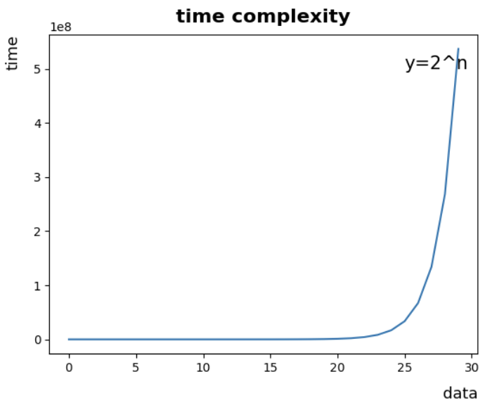

# 시간복잡도

## 시간복잡도 (time complecsity)
- 알고리즘의 성능을 수학적으로 표기하는 방식
- 알고리즘의 시간, 공간 복잡도 설명 가능
- 나타내는 방법에는 빅-오(Big-O, worst case), 빅-오메가(Big-Ω, best case), 빅-세타(Big-θ, average)가 있다.

<br>

## 빅 오(Big-O) 표기법
- 빅 오 표기법에서 상수는 생략한다.
- 가장 오래 걸리는 경우(worst case)를 생각할 때 사용.
- 정확한 실행 시간을 계산하는 데에 목적 X
- 데이터 값 증가에 따른 알고리즘의 성능을 예측할 때 사용

<br>

### O(1)

- 입력 데이터의 크기에 상관없이 언제나 일정한 시간이 걸리는 알고리즘

<br>

---

<br>

### O(n)

- 입력 데이터에 비례하여 처리 속도가 증가하는 알고리즘
- 데이터와 처리속도가 일정한 비율로 증가함

<br>

---

<br>

### O(n<sup>2</sup>)


- 반복문 안에서 반복문을 실행할 때
    ``` python
    def Func(n) :
        for i in range(n):
            for j in range(n):
                print(i + j)
    ```

<br>

---

<br>

### O(nM)
- n번 반복하는 반복문 안에서 m번 반복하는 반복문이 실행될 때
    ``` python
    def Func(n, m):
        for i in range(n):
            for j in range(m):
                print(i + j)
    ```

<br>

---
<br>

### O(2<sup>n</sup>)

- 피보나치 수열 등
- 함수가 실행될 때마다 재귀함수 두 개를 실행하는 경우
    ``` python
    def Func(n, r) :
        if n <= 0:
            return 0
        elif n == 1 :
            return r[n] = 1
        return r[n] = Func(n-1, r) + Func(n-2, r)
    ```

<br>

---
<br>

### O(log n) :

- 이진탐색 등
- 처리가 진색될 때마다 검색해야 하는 데이터 값이 반으로 줄어들 때

<br>

---

<br>

### O(Sqrt(n))
- n의 제곱근 수만 계산하는 알고리즘